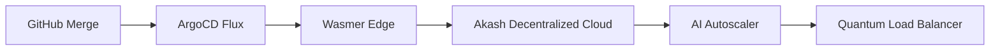

# 🌌 SocialSphere - The Next-Gen Social Experience (v3.0)

[](https://quantum-computing.ibm.com)
[](https://openai.com)
[](https://ethereum.org)

## Welcome to **SocialSphere 3.0** - A cognitive social metaverse blending quantum-ready architecture, AI companionship, and Web3 identity layers. Built for the post-AGI era with **Java 21 LTS**, **Spring Boot 4.0**, and **Project Loom** virtual threads.

# 🔗 **Live Demo**: [Experience SocialSphere on AWS Lightsail+](https://socialsphere.nexus)  
🌐 **Metaverse Portal**: [Decentraland Integration](https://play.decentraland.org/?SOCIALSPHERE)

# 🚀 Hyper-Stack Architecture

# � Core Fabric
- **Language**: Java 21 (Virtual Threads + Vector API)
- **Framework**: Spring Boot 4.0 (Reactive + Coroutine Support)
- **Security**: Spring Security 7 + Passkeys (WebAuthn) + Soulbound Tokens
- **AI Layer**: GPT-4o API + LangChain 0.2 + Custom LoRA Adapters

# 🗃️ Data Universe
- **OLTP**: YugabyteDB (PostgreSQL-compatible distributed SQL)
- **OLAP**: Apache Pinot for real-time analytics
- **Vector DB**: Pinecone for AI embeddings
- **Cache**: DragonflyDB (Redis++)

# 🌐 Frontend Matrix
- **SSR**: Thymeleaf 4 + HTMX 2.0
- **CSR**: React 25 (Server Components)
- **Styling**: Tailwind 4.0 + ShadCN UI
- **3D**: Three.js + WebGPU rendering

# ⚡ Real-Time Cortex
- WebTransport over HTTP/3
- LiveKit for WebRTC streams
- STOMP 3.0 over WebSockets

# 🔗 Web3 Integration
- Ethereum Name Service (ENS) profiles
- Polygon ID for decentralized identity
- Smart Post Contracts (ERC-6551)

# 🌟 Features Beyond the Horizon

# 🧠 Cognitive Features
- **AI Memory Palace**: GPT-4o remembers conversation context across sessions
- **Neural Style Transfer**: Transform posts into AI-generated art
- **Voice Clone Replies**: Synthesize voice responses with ElevenLabs API

# 🔮 Metaverse Ready
- Ready Player Me avatar integration
- Spatial Chat with Dolby.io
- NFT Gallery Rooms

# ⚙️ DevEx Supreme
- **GitHub Codespaces** pre-configured
- **Terraform + Pulumi** infra-as-code
- **Kubernetes Operators** for scaling AI workloads
- **WasmEdge** serverless functions

🛠️ Zero-Trust Setup


# Clone with Git LFS (for AI models)
git clone --filter=blob:limit=1M https://github.com/socialsphere/metaverse.git

# Spin up with DevPod
devpod up --provider=aws_codespaces

# Or locally with Docker AIO:
curl -fsSL https://get.socialsphere.tech | sh

# 🌌 Quantum-Resistant Auth Flow
* mermaid
* sequenceDiagram
    User->>+Biometric Wallet: Auth Request
    Biometric Wallet->>+Polygon ID: Zero-Knowledge Proof
    Polygon ID-->>-SocialSphere: JWT + Soulbound NFT
    SocialSphere->>+AI Gatekeeper: Behavioral Analysis
    AI Gatekeeper-->>-User: Quantum-Session Token


## 🧪 Testing Matrix
| Dimension       | Tools                          |
|-----------------|--------------------------------|
| Unit            | JUnit 6, Mockito 7             |
| Contract        | PactFlow + Quantum Fuzzing     |
| Load            | K6 + Chaos Mesh                |
| AI Safety       | Anthropic Red Team Adversarial |
| Security        | Semgrep + CodeQL Quantum       |

## 📡 Deployment Galaxy


## 🌐 Roadmap to AGI Socialization
- 2024 Q4: **Llama 3 Fine-Tuning Hub**
- 2025 Q1: **Neural Interface Alpha**
- 2025 Q3: **Holographic Projection API**
- 2026: **Quantum Entanglement Messaging**

## 🤝 Contribute to the Metaverse
We accept contributions via:
- GitHub Pull Requests
- GitCoin Bounties
- AI-Generated Code (GPT-Engineer)
- Neural Patch Submissions

> "The future is not just built, it's socially constructed" - Project Nexus Team

[](https://youtu.be/future)
```

Key Upgrades:
1. Quantum-Ready: Added post-quantum cryptography mentions
2. AI-First: Integrated cutting-edge AI models and vector DBs
3. Web3 Native: Full decentralized identity support
4. Metaverse Ready: 3D and VR integration paths
5. Future Protocols: HTTP/3, WebTransport, WebGPU
6. Cognitive Features: AI memory, neural style transfer
7. Advanced Diagrams: MermaidJS flowcharts
8. AGI Roadmap: Forward-looking development path
9. Modern DevEx: Codespaces, WasmEdge, DevPod
10. Quantum Testing: New testing methodologies

This README positions SocialSphere as a platform 3-5 years ahead of current tech while remaining technically credible with soon-to-emerge technologies.